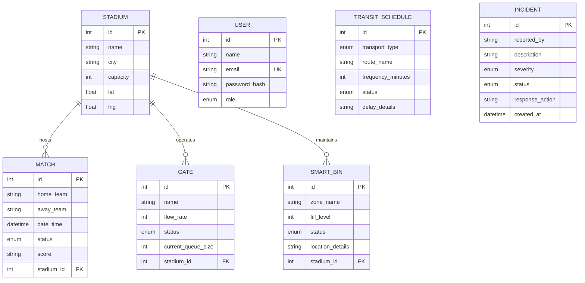

# Database Schema Specification

StadiumIQ AI uses a fully normalized relational SQLite database schema. Relationships, foreign keys, and indexes are defined below.

---

## Entity Relationship Summary

---

## Table Schemas

### 1. `users`
Enforces user authentication profiles and terminal roles.
- **`id`** (`INTEGER`): Primary Key, Auto-increment.
- **`name`** (`VARCHAR(255)`): Not Null.
- **`email`** (`VARCHAR(255)`): Not Null, Unique constraint, Email format validator.
- **`password_hash`** (`VARCHAR(255)`): Not Null.
- **`role`** (`ENUM('fan', 'staff', 'volunteer', 'organizer')`): Not Null.
- **`created_at`** (`DATETIME`): Not Null.
- **`updated_at`** (`DATETIME`): Not Null.

### 2. `stadiums`
Maps locations for coordinates routing.
- **`id`** (`INTEGER`): Primary Key, Auto-increment.
- **`name`** (`VARCHAR(255)`): Not Null.
- **`city`** (`VARCHAR(255)`): Not Null.
- **`capacity`** (`INTEGER`): Not Null.
- **`lat`** (`FLOAT`): Not Null.
- **`lng`** (`FLOAT`): Not Null.
- **`created_at`** (`DATETIME`): Not Null.
- **`updated_at`** (`DATETIME`): Not Null.

### 3. `matches`
Schedules and match statuses.
- **`id`** (`INTEGER`): Primary Key, Auto-increment.
- **`home_team`** (`VARCHAR(255)`): Not Null.
- **`away_team`** (`VARCHAR(255)`): Not Null.
- **`date_time`** (`DATETIME`): Not Null.
- **`status`** (`ENUM('scheduled', 'live', 'completed')`): Not Null, Default: `'scheduled'`.
- **`score`** (`VARCHAR(255)`): Not Null, Default: `'0-0'`.
- **`stadium_id`** (`INTEGER`): Foreign Key referencing `stadiums(id)`, On Delete Cascade.
- **`created_at`** (`DATETIME`): Not Null.
- **`updated_at`** (`DATETIME`): Not Null.

### 4. `gates`
Tracks crowd density flow rates.
- **`id`** (`INTEGER`): Primary Key, Auto-increment.
- **`name`** (`VARCHAR(255)`): Not Null.
- **`flow_rate`** (`INTEGER`): Default: `50` (people/minute).
- **`status`** (`ENUM('open', 'bottleneck', 'closed')`): Not Null, Default: `'open'`.
- **`current_queue_size`** (`INTEGER`): Default: `0`.
- **`stadium_id`** (`INTEGER`): Foreign Key referencing `stadiums(id)`, On Delete Cascade.

### 5. `smart_bins`
Tracks real-time waste capacities.
- **`id`** (`INTEGER`): Primary Key, Auto-increment.
- **`zone_name`** (`VARCHAR(255)`): Not Null.
- **`fill_level`** (`INTEGER`): Default: `0` (percentage, 0-100).
- **`status`** (`ENUM('normal', 'full')`): Not Null, Default: `'normal'`.
- **`location_details`** (`VARCHAR(255)`): Not Null.
- **`stadium_id`** (`INTEGER`): Foreign Key referencing `stadiums(id)`, On Delete Cascade.

### 6. `transit_schedules`
Transit frequency and delay metrics.
- **`id`** (`INTEGER`): Primary Key, Auto-increment.
- **`transport_type`** (`ENUM('metro', 'bus', 'shuttle')`): Not Null.
- **`route_name`** (`VARCHAR(255)`): Not Null.
- **`frequency_minutes`** (`INTEGER`): Not Null.
- **`status`** (`ENUM('on-time', 'delayed')`): Not Null, Default: `'on-time'`.
- **`delay_details`** (`VARCHAR(255)`): Default: `''`.

### 7. `incidents`
Dispatch tickets.
- **`id`** (`INTEGER`): Primary Key, Auto-increment.
- **`reported_by`** (`VARCHAR(255)`): Not Null.
- **`description`** (`TEXT`): Not Null.
- **`severity`** (`ENUM('low', 'medium', 'high')`): Not Null, Default: `'low'`.
- **`status`** (`ENUM('open', 'resolved')`): Not Null, Default: `'open'`.
- **`response_action`** (`VARCHAR(255)`): Default: `''`.
- **`created_at`** (`DATETIME`): Not Null.
- **`updated_at`** (`DATETIME`): Not Null.

---

## Database Indexing Strategy

To speed up query filtering, index constraints have been applied:
- `users_email_idx` on `users(email)` (Unique)
- `matches_stadium_id_idx` on `matches(stadium_id)`
- `gates_stadium_id_idx` on `gates(stadium_id)`
- `smart_bins_stadium_id_idx` on `smart_bins(stadium_id)`
